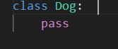
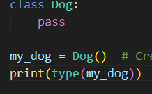
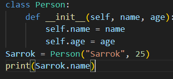
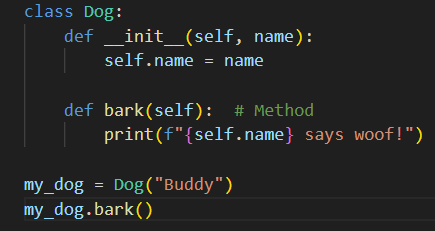
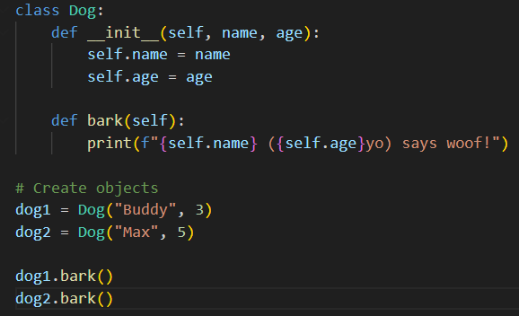

# Python :Class, Object, self and __init__

## Class
A class is a blueprint or template for creating objects. It defines attributes (data) and methods (functions) that objects will have.

How it works: You define a class with class keyword. It groups related code together.

## Example

## Object
An object (or instance) is a specific creation from a class. It's like a real-world item made from the blueprint.

How it works: Use the class name with () to create an object. Each object has its own copy of attributes.

## Example

## __init__ Method
The __init__ method is a special constructor that runs automatically when you create an object. It initializes (sets up) the object's attributes.

How it works: Takes self as first parameter, then any initial values. Assign attributes with self.attribute = value.

## Example

## self
self is a reference to the current instance (object) of the class. It's used inside methods to access attributes and other methods of that object.

How it works: Always the first parameter in methods (except static/class methods). It lets you work with the specific object's data.

## Example

### Quick Full Example

# Why there is no public, private, protected )